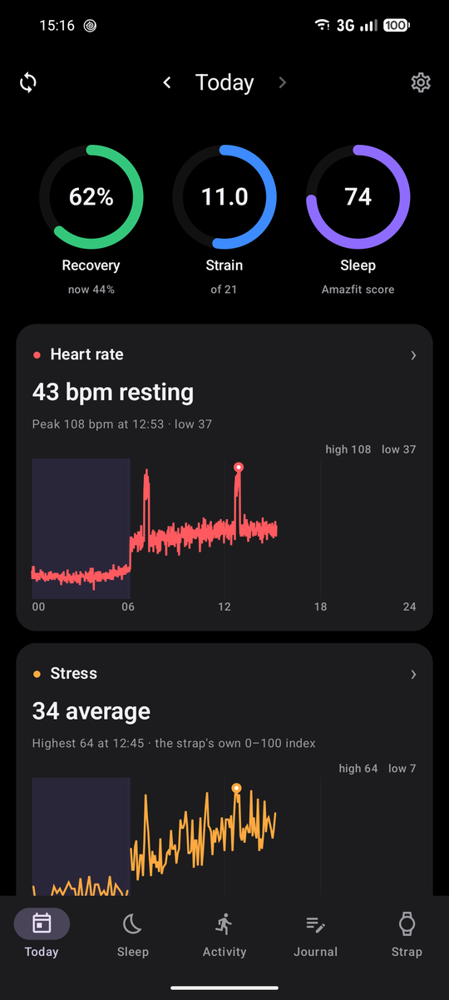
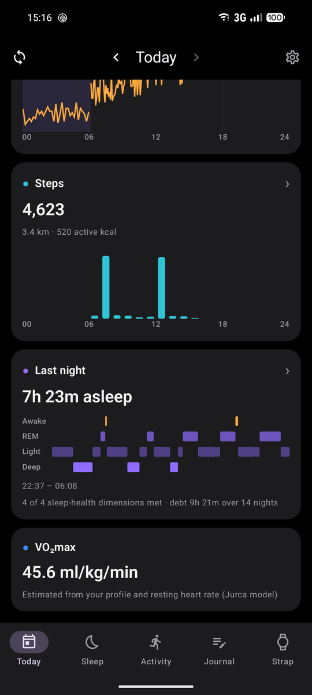
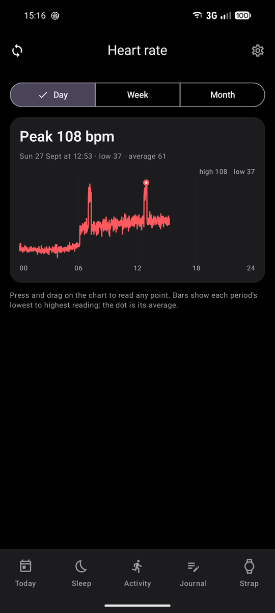
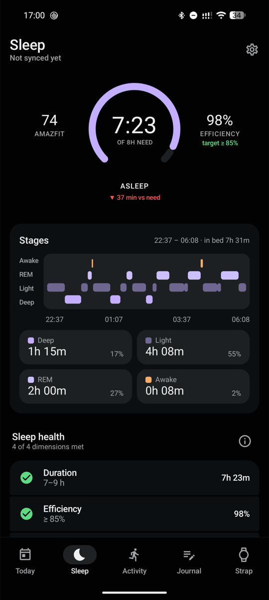
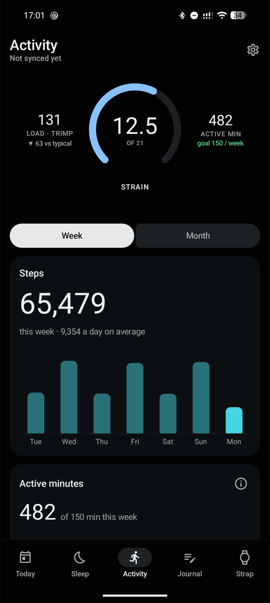

# Ridge

**Your Amazfit Helio Strap's data, off the Zepp cloud and on your own server, with honest,
cited metrics and a light Android app.**

Ridge syncs the strap directly over Bluetooth. Nothing goes through Zepp's servers when you
use it. The phone pushes what it collected to a small server you run yourself, which works
out your days: recovery, strain, sleep, heart rate, stress, steps and more. The app then
reads them back from there.

`strap` is the codename you will see in the code, the server and the package names.

  
  
  
  
  

Screenshots show synthetic demo data (`tools/demo-data`), not a real person's.

## What you get

- **Today**: recovery, strain and sleep rings, per-minute heart rate and stress with the
  peaks kept, hourly steps, and last night's stages. Step back through past days.
- **Sleep, Activity, Journal**: nights and their stages, workouts and daily activity, and
  a journal for caffeine, alcohol and weight.
- **Strap**: battery, the strap's own alarms (read, add, edit, delete), and its heart-rate,
  stress, SpO₂, sleep and workout-detection settings (read-only for now).
- **Metrics that say why when they can't answer.** A number that lacks the data it needs
  is withheld and names the reason ("sync the strap", "log your weight"), never shown as
  a zero or a guess. Every formula, constant, gate and source is written down in
  [`docs/spec/02-science.md`](docs/spec/02-science.md).
- **Your data stays yours**: on your phone, then on your server. Ridge has no account, no
  cloud and no analytics. (Your Zepp account is needed once, on your computer, to fetch
  the strap's key: see [What you need](#what-you-need).)

## What it is not

- **Not a medical device** and not medical advice. The illness flag and similar signals
  are prompts to pay attention, not diagnoses.
- **Not affiliated with Amazfit, Zepp Health or Huami.**
- Not a Zepp app replacement for everything. You still need the Zepp app to pair the
  strap and to update its firmware, and your Zepp account once per pairing to fetch the
  strap's key.

## Limitations

- **Android 12 or newer only.** There is no iPhone app.
- **The Amazfit Helio Strap only.** Tested with firmware 0.132.27.2. Other Zepp OS devices
  speak a similar protocol but are untested.
- **You need a server.** The app syncs without one, but the daily numbers are computed on
  the server. A small always-on machine with Docker is enough.
- **One person per server.** There is one device token, no accounts and no sign-up.
- **Syncing is manual.** Press sync when you want fresh data; nothing runs in the
  background (D19).
- **Getting the strap's auth key needs your Zepp account, once per pairing**, signed in
  with email and password (see [What you need](#what-you-need)).
- Strap settings other than alarms can be read, not yet changed.
- No GPS. English only.

## What you need

- **The strap, paired with the official Zepp app** on your phone, with any pending firmware
  update installed.
- **Your Zepp account's email and password.** The strap only talks to someone who knows its
  *auth key*, 16 bytes the Zepp app created when it paired the strap and stored in your
  Zepp cloud account. Ridge cannot pair a strap or make its own key, so a small script
  signs in to your Zepp account once and reads the key from there. Accounts that sign in
  with Google, Apple or Facebook don't work unless they also have a password. Signing in
  logs the Zepp app out; the key is not affected.
- **A computer with [uv](https://docs.astral.sh/uv/)** to run that script. The Ridge app
  itself never talks to Zepp.
- **An Android 12+ phone.**
- **An always-on machine with Docker** for the server, reachable from the phone over HTTPS.

You end up with two secrets: the strap's **MAC and auth key** (from your Zepp account), and
the server's **token** (made by the server's setup). The app asks for both during setup.

## Getting started

1. **Run the server**: [`deploy/README.md`](deploy/README.md). Docker Compose, about ten
   minutes, then put HTTPS in front of it. Keep the token it prints.
2. **Get your strap's MAC and auth key from your Zepp account**:
   `uv run tools/keyfetch/keyfetch.py you@example.com --qr`. Details, and how to keep the
   Zepp app from grabbing the strap afterwards:
   [`tools/keyfetch/README.md`](tools/keyfetch/README.md). Already use Gadgetbridge? Its
   device export holds the same key.
3. **Install the app** from the
   [latest release](https://github.com/TheCommishDeuce/ridge-helio-strap/releases) and open
   it. Setup walks you through pairing the strap (MAC and key), connecting your server
   (address and token, tested before it is saved) and the first sync. Later changes live
   under the gear (Settings).

## How it's built

| Part | Where | What |
|---|---|---|
| Strap protocol | `android/strap-protocol/` | Pure Kotlin/JVM: B-163 ECDH handshake, framing, encryption, fetch rounds, decoders, all tested without a phone |
| App | `android/app/` | Jetpack Compose UI, Bluetooth transport, local store and upload outbox |
| Server | `server/` | Python, FastAPI and TimescaleDB: ingest, the science layer, the read API |
| Self-hosting | `deploy/` | Docker Compose kit and guide |
| Key tool | `tools/keyfetch/` | One-shot Zepp account → MAC and auth key |

More: [`docs/ARCHITECTURE.md`](docs/ARCHITECTURE.md) for how the pieces fit,
[`docs/spec/01-strap-protocol.md`](docs/spec/01-strap-protocol.md) for everything the strap
says over Bluetooth, byte by byte, and [`docs/DECISIONS.md`](docs/DECISIONS.md) for why
things are the way they are. To build, test or contribute, see
[`CONTRIBUTING.md`](CONTRIBUTING.md).

## Licence

AGPL-3.0-or-later (D25): see [`LICENSE`](LICENSE), and [`NOTICE`](NOTICE) for credits and
bundled files. The protocol knowledge comes from
[Gadgetbridge](https://codeberg.org/Freeyourgadget/Gadgetbridge), whose work made this
possible.
